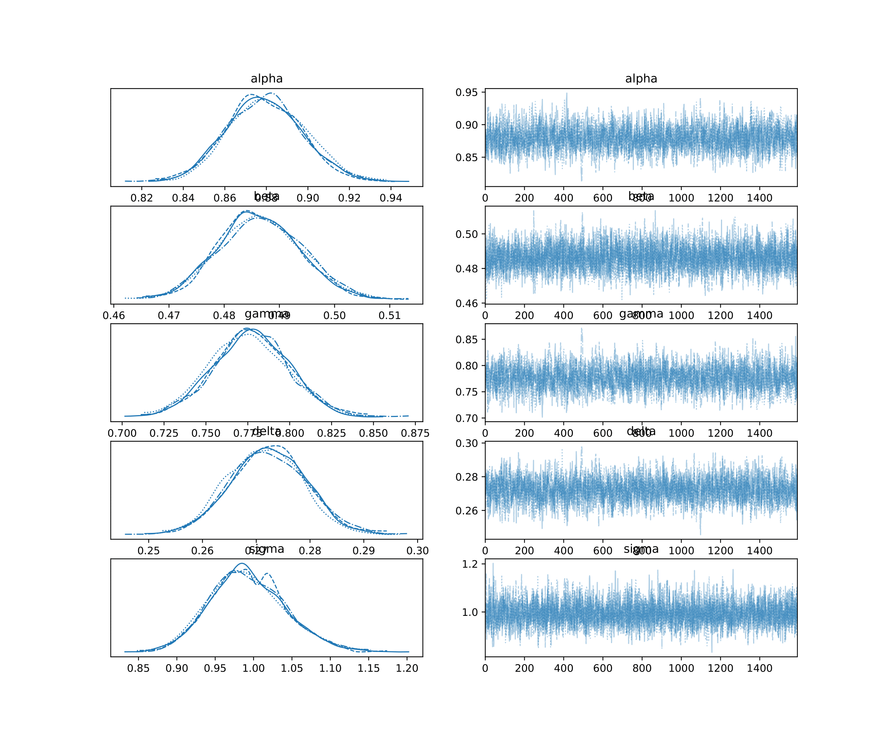
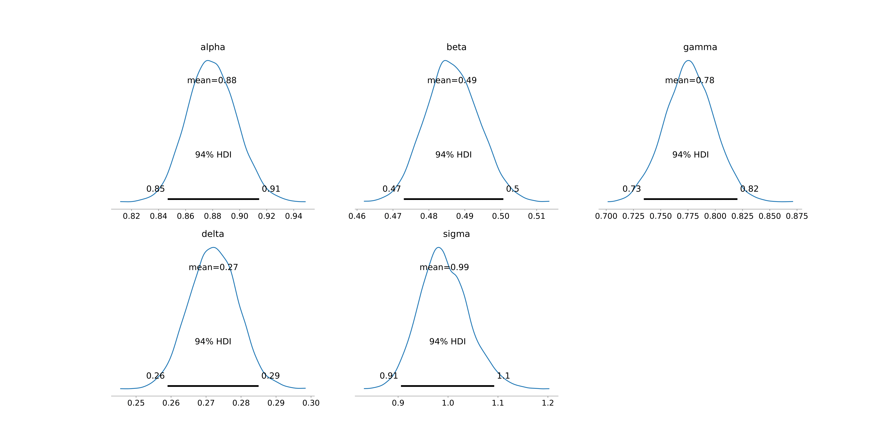
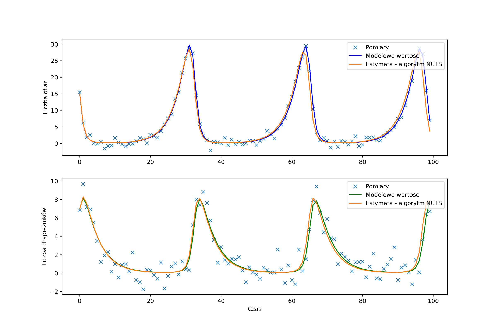

# NonlinearStateEstimation

##### Project goals

This project aimed to estimate the state of nonlinear dynamic objects using MCMC algorithms (Markov chain Monte Carlo) and compare it with the results obtained with the Unscented Kalman Filter and the Particle Filter.

##### Technologies used
Python 3.11 - a high-level programming language with an extensive library package. Thanks to its
transparent syntax it allows you to create advanced, but most of all readable source codes.

PyMC - a library containing efficient implementations of MCMC algorithms.

Filterpy - a library with UKF algorithm implementation.

##### Overview

The project estimates the state of two nonlinear objects: pendulum and Lotka-Volterra. The algorithms used in this project are:

1. Metropolis-Hastings,
2. Slice,
3. NUTS (No-U-Turn Sampler),
4. Unscented Kalman Filter,
5. Particle Filter, more specifically: Approximate Bayesian Computation.

##### Results achieved

For each MCMC algorithm, there are 3 generated plots saved in *.pdf format:
1. The first plot pictures a trace plot with two columns: on the left one can see smoothed histograms of marginal posterior distributions for each of the stochastic random variables used in the model; the right column shows samples of a value in a Markov chain over time. 
2. The second plot shows HDIs - Highest Density Integral.
3. The third and final plot shows the result of the algorithm compared to measurements and the true state curve.

An example of such plots are shown below:

1. 
2. 
3. 

The same plots are obtained with the SMC algorithm. 
The result with the UKF is just one plot with final predictions.
